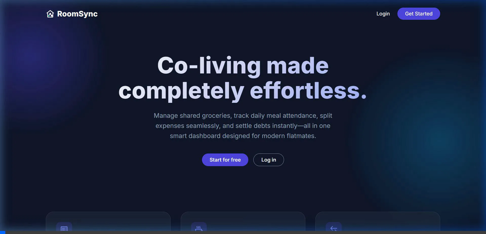

# RoomSync



**Live Demo:** [https://roomsync-production-82ed.up.railway.app/](https://roomsync-production-82ed.up.railway.app/)

> **A shared living management platform for roommates, hostel students, PG residents, and shared apartments.**

RoomSync is a lightweight web application that helps people living together manage everyday household activities such as grocery purchases, shopping responsibilities, meal attendance, shared expenses, payments, settlements, and spending analytics—all from a single platform.

---

## Features

- **Light & Dark Theme Support**: System-preference detection with a manual toggle and seamless FOUC (Flash of Unstyled Content) prevention.
- **Grocery Management**: Track purchases, assign members to shopping lists, and automatically split costs.
- **Meal Planning**: Daily lunch and dinner intimation with dietary categorization (Veg, Non-Veg, Egg).
- **Expense & Settlements**: 
  - Record shared expenses with equal or custom splitting.
  - Track cash and UPI payments with an undo capability.
  - Automated settlement calculation using a greedy algorithm to minimize transactions.
- **Visual Analytics**: Monthly spending dashboards powered by Chart.js.
- **Group Administration**: 
  - Multi-group support allowing users to be part of multiple households.
  - Role-based permissions (Admin vs Member).
  - Invite links and scannable QR codes for easy onboarding.
  - Configurable joining workflows (Direct Join vs Admin Approval for pending requests).
- **Modern & Responsive UI**: Sleek landing page with animated horizontal sliders, glassmorphism design, and a fully mobile-optimized interface.
- **Robust Testing**: Comprehensive testing suite built with Jest & Supertest to ensure the integrity of expense logic and settlement algorithms.

---

## Technology Stack

| Layer | Technology |
|--------|------------|
| **Frontend** | HTML5, CSS3, Bootstrap 5, Vanilla JavaScript |
| **Backend** | Node.js, Express.js |
| **Database** | SQLite (Local Development) / MySQL (Production) |
| **Authentication** | Express Session + bcrypt |
| **Charts** | Chart.js |
| **Deployment** | Vercel & Railway |

---

## Project Structure

```text
roomsync/
├── config/
├── controllers/
├── database/
├── middleware/
├── models/
├── public/
│   ├── css/
│   ├── js/
│   └── pages/
├── routes/
├── utils/
├── docs/
├── package.json
├── server.js
├── vercel.json
└── README.md
```

---

## Installation & Setup

### 1. Clone the Repository

```bash
git clone https://github.com/<your-username>/roomsync.git
cd roomsync
```

### 2. Install Dependencies

```bash
npm install
```

### 3. Run the Application Locally

By default, RoomSync uses a local **SQLite** database for development. You do not need to configure any external database to run it locally. It will initialize and seed `database/roomsync.db` on the first run.

```bash
npm start
```

Once the server starts, open `http://localhost:3000` in your browser.

---

## Production Deployment (Vercel + MySQL)

For deploying to production environments, RoomSync automatically switches to MySQL when `DATABASE_URL` is provided. The application initializes missing tables and applies safe compatibility migrations on startup.

1. Import [Ankitj9568/RoomSync](https://github.com/Ankitj9568/RoomSync) into Vercel.
2. Set up a MySQL database (for example, using Railway or PlanetScale).
3. Set the following environment variables in Vercel:
   - `DATABASE_URL`: Your full MySQL connection string.
   - `SESSION_SECRET`: A secure random string for signing cookies.
4. Deploy the application. RoomSync includes a `vercel.json` file ready for GitHub-based Vercel deployment.


---

## REST API

RoomSync exposes a RESTful API for managing all shared household activities.

### Available Modules

| Module | Endpoint |
|----------|-----------|
| Authentication | `/api/auth/*` |
| Users | `/api/users/*` |
| Groups | `/api/groups/*` |
| Group Settings | `/api/groups/:id/settings` |
| Groceries | `/api/groceries` |
| Shopping List | `/api/shopping-list` |
| Meals | `/api/meals` |
| Expenses | `/api/expenses` |
| Payments | `/api/payments` |
| Adjustments | `/api/adjustments` |
| Dashboard | `/api/dashboard` |
| Settlements | `/api/settlements` |
| Analytics | `/api/analytics` |

---
