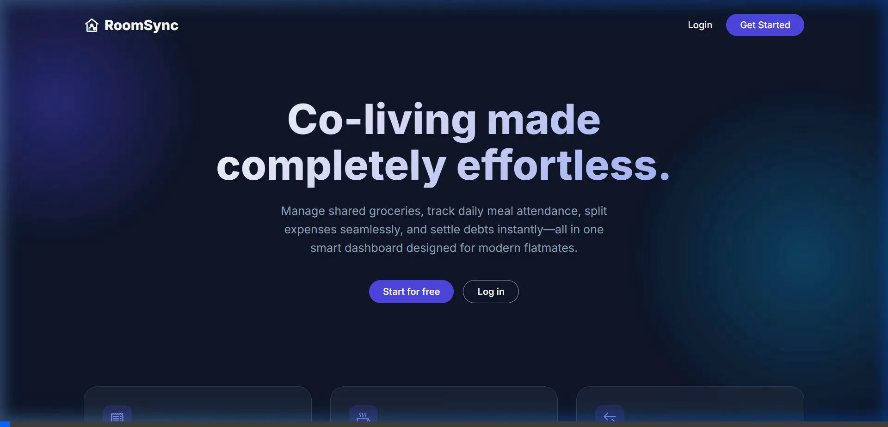

# RoomSync



**Live Demo:** [https://room-sync-kappa.vercel.app/](https://room-sync-kappa.vercel.app/)

> **A shared living management platform for roommates, hostel students, PG residents, and shared apartments.**

RoomSync is a lightweight web application that helps people living together manage everyday household activities such as grocery purchases, shopping responsibilities, meal attendance, shared expenses, payments, settlements, and spending analytics—all from a single platform.

---

## Features

- **Light & Dark Theme Support**: System-preference detection with a manual toggle and seamless FOUC (Flash of Unstyled Content) prevention.
- **Grocery Management**: Track purchases, assign members to shopping lists, and automatically split costs.
- **Meal Planning**: Daily lunch and dinner intimation with dietary categorization (Veg, Non-Veg, Egg).
- **Expense & Settlements**: 
  - Record shared expenses with equal or custom splitting.
  - Track cash and UPI payments with an undo capability.
  - Automated settlement calculation using a greedy algorithm to minimize transactions.
- **Visual Analytics**: Monthly spending dashboards powered by Chart.js.
- **Group Administration**: 
  - Multi-group support allowing users to be part of multiple households.
  - Role-based permissions (Owner, Admin, Member, Staff). Owners manage like
    admins; staff (chef, maid, caretaker) use meals, groceries, and shopping
    lists but are excluded from financials.
- **Household Tasks**: Owners assign chores (cooking, cleaning, laundry, grocery runs, maintenance, security) to staff or members; assignees mark them done.
- **Owner Oversight**: PG/flat owners get a dedicated home with occupancy, rent collection, dues owed to them, and task status — roommate-shared money stays between roommates.
- **Owner MFA**: Owners must enroll a TOTP authenticator second factor; staff accounts can be provisioned by owners with a one-time temporary password.
  - Invite links and scannable QR codes for easy onboarding.
  - Configurable joining workflows (Direct Join vs Admin Approval for pending requests).
- **Modern & Responsive UI**: Sleek landing page with animated horizontal sliders, glassmorphism design, and a fully mobile-optimized interface.
- **Robust Testing**: Comprehensive testing suite built with Jest & Supertest to ensure the integrity of expense logic and settlement algorithms.
- **Mobile E2E Smoke Test**: Playwright verifies registration-to-dashboard on a mobile viewport (`npm run test:e2e` with the server running).

---

## Technology Stack

| Layer | Technology |
|--------|------------|
| **Frontend** | HTML5, CSS3, Bootstrap 5, Vanilla JavaScript |
| **Backend** | Node.js, Express.js |
| **Database** | PostgreSQL through Prisma |
| **Authentication** | Signed cookie sessions, password login, and Google OAuth |
| **Charts** | Chart.js |
| **Deployment** | Vercel & Supabase |

---

## Project Structure

```text
roomsync/
├── frontend/            # Static UI served by Express
│   ├── css/
│   ├── js/
│   ├── pages/
│   └── index.html
├── backend/             # Node.js + Express API
│   ├── server.js        # Entry point (serves frontend/ + mounts /api/*)
│   ├── config/
│   ├── controllers/
│   ├── middleware/
│   ├── models/
│   ├── routes/
│   └── utils/
├── database/            # Prisma schema + migrations, legacy SQL reference
│   └── prisma/
├── tests/               # Jest unit/integration + Playwright e2e
├── scripts/
├── docs/
├── package.json
├── vercel.json
└── README.md
```

---

## Installation & Setup

### 1. Clone the Repository

```bash
git clone https://github.com/<your-username>/roomsync.git
cd roomsync
```

### 2. Install Dependencies

```bash
npm install
```

### 3. Run the Application Locally

RoomSync uses **PostgreSQL through Prisma** in development and production. Create a Supabase project (or local PostgreSQL database), copy `DATABASE_URL` and `DIRECT_URL` into `.env`, then initialize the schema:

```bash
npx prisma migrate deploy
npm start
```

Once the server starts, open `http://localhost:3000` in your browser.

---

## Production Deployment (Vercel + Supabase PostgreSQL)

For production, RoomSync uses PostgreSQL through Prisma. Prisma migrations create the schema; the application does not mutate the database schema during requests.

1. Import [Ankitj9568/RoomSync](https://github.com/Ankitj9568/RoomSync) into Vercel.
2. Create a Supabase PostgreSQL project.
3. Set the following environment variables in Vercel:
   - `DATABASE_URL`: Supabase pooled PostgreSQL URL.
   - `DIRECT_URL`: Supabase direct PostgreSQL URL for Prisma migrations.
   - `SESSION_SECRET`: A secure random string for signing cookies.
   - `NODE_ENV`: `production`.
   - `GOOGLE_CLIENT_ID` and `GOOGLE_CLIENT_SECRET` for Google login.
   - `GOOGLE_CALLBACK_URL`: `https://your-domain.vercel.app/api/auth/google/callback`.
4. Run `npx prisma migrate deploy` once against the production database, then deploy the application.
5. Deploy the application. RoomSync includes a `vercel.json` file ready for GitHub-based Vercel deployment.

To migrate the existing MySQL data, set `MYSQL_DATABASE_URL` locally and run:

```bash
npm run db:migrate:mysql-to-postgres
```


---

## REST API

RoomSync exposes a RESTful API for managing all shared household activities.

### Available Modules

| Module | Endpoint |
|----------|-----------|
| Authentication | `/api/auth/*` |
| Users | `/api/users/*` |
| Groups | `/api/groups/*` |
| Group Settings | `/api/groups/:id/settings` |
| Groceries | `/api/groceries` |
| Shopping List | `/api/shopping-list` |
| Meals | `/api/meals` |
| Expenses | `/api/expenses` |
| Payments | `/api/payments` |
| Adjustments | `/api/adjustments` |
| Dashboard | `/api/dashboard` |
| Settlements | `/api/settlements` |
| Analytics | `/api/analytics` |

---
